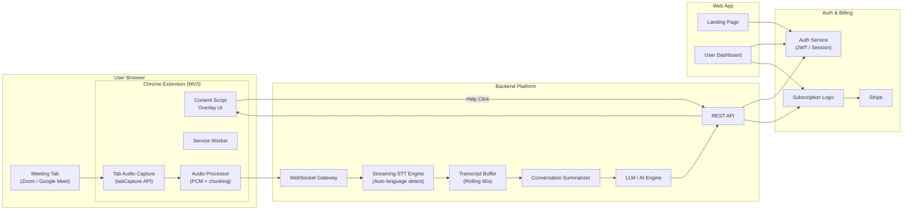

# Workflow diagram

```mermaid
flowchart LR
    subgraph Browser["User Browser"]
        subgraph CE["Chrome Extension (MV3)"]
            CS["Content Script<br/>Overlay UI"]
            SW["Service Worker"]
            AC["Tab Audio Capture<br/>(tabCapture API)"]
            AP["Audio Processor<br/>(PCM + chunking)"]
        end

        Meet["Meeting Tab<br/>(Zoom / Google Meet)"]
    end

    subgraph Backend["Backend Platform"]
        WS["WebSocket Gateway"]
        STT["Streaming STT Engine<br/>(Auto language detect)"]
        TB["Transcript Buffer<br/>(Rolling 60s)"]
        SUM["Conversation Summarizer"]
        AI["LLM / AI Engine"]
        API["REST API"]
    end

    subgraph AuthBilling["Auth & Billing"]
        AUTH["Auth Service<br/>(JWT / Session)"]
        SUB["Subscription Logic"]
        STRIPE["Stripe"]
    end

    subgraph Web["Web App"]
        LP["Landing Page"]
        DASH["User Dashboard"]
    end

    %% Browser flow
    Meet --> AC
    AC --> AP
    AP --> WS

    %% Backend audio & AI flow
    WS --> STT
    STT --> TB
    TB --> SUM
    SUM --> AI
    AI --> API

    %% Help button flow
    CS -->|Help Click| API
    API --> CS

    %% Auth & billing
    API --> AUTH
    API --> SUB
    SUB --> STRIPE

    %% Web app
    LP --> AUTH
    DASH --> AUTH
    DASH --> SUB
```
